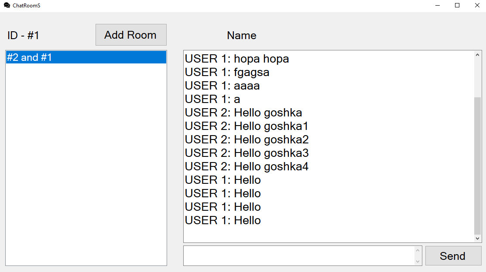
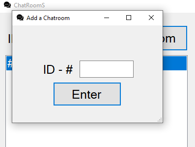

# ChatRoomS
ChatRoomS is a C# application which connects users to a chatroom. The application uses a centralised server which collects and sends all messages from users to one another. It is currently work-in-progress.

